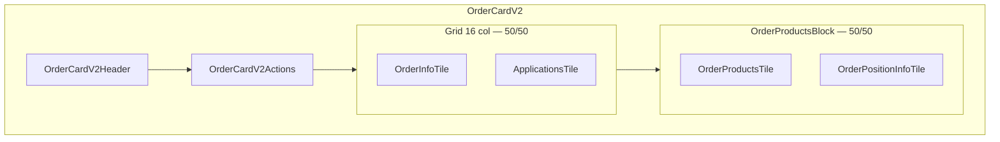

# Тайл «Информация» и название заказа

## Целевой layout карточки



- **Убрать:** [`OrderJobTile.tsx`](front/src/components/blocks/order-card-v2/OrderJobTile.tsx) и [`order-job-tile.css`](front/src/components/blocks/order-card-v2/order-job-tile.css) из [`OrderCardV2.tsx`](front/src/components/blocks/order-card-v2/OrderCardV2.tsx)
- **Добавить:** строку с двумя колонками `span={8}` по образцу [`OrderProductsBlock.tsx`](front/src/components/blocks/order-card-v2/OrderProductsBlock.tsx)

---

## Этап 1 — БД и типы

**Prisma** ([`back-nest/prisma/schema.prisma`](back-nest/prisma/schema.prisma)):

```prisma
model Order {
  id       String  @id @default(uuid())
  authorId String
  name     String?   // nullable, без default
  ...
}
```

**Миграция:** `ALTER TABLE orders ADD COLUMN name TEXT;`

**Shared types** ([`types/src/order.ts`](types/src/order.ts)):

```ts
export type Order = {
  authorId: string;
  name?: string | null;
};

/** Отображаемое имя: name или id, если name пустой/null. */
export function orderDisplayName(order: Pick<Order, 'name'> & { id: string }): string
```

**Zod-схема** — новый файл [`types/src/schemas/order.schemas.ts`](types/src/schemas/order.schemas.ts):

```ts
export const UpdateOrderSchema = z.object({
  name: z.string().trim().min(1).max(200).nullable().optional(),
});
```

- Пустая строка на фронте → `null` при сохранении (сброс названия)
- Экспорт через [`types/src/schemas/index.ts`](types/src/schemas/index.ts)

---

## Этап 2 — Backend API

**Service** ([`back-nest/src/orders/orders.service.ts`](back-nest/src/orders/orders.service.ts)):

- `update(id, { name })` — `prisma.order.update`, пустая строка → `null`
- `getOrders` — добавить `orderBy: { createdAt: 'desc' }` (новые заказы первыми)

**DTO:** [`back-nest/src/orders/dto/update-order.dto.ts`](back-nest/src/orders/dto/update-order.dto.ts) через `createZodDto(UpdateOrderSchema)`

**Controller** ([`back-nest/src/orders/orders.controller.ts`](back-nest/src/orders/orders.controller.ts)):

```ts
@Patch(':id')
update(@Param('id') id: string, @Body() dto: UpdateOrderDto): Promise<Stored<Order>>
```

**Регенерация клиента:** `npm run generate-client` → метод `orders.update` в [`front/src/lib/generated/orders.client.ts`](front/src/lib/generated/orders.client.ts)

---

## Этап 3 — Список заказов

[`front/src/pages/OrdersPage.tsx`](front/src/pages/OrdersPage.tsx):

- В `orderListDefinition` добавить строку **«Название»** с `orderDisplayName(order)` как primary label
- Автор и дата — secondary (как сейчас)
- Сортировка на бэкенде (`createdAt desc`); клиент не сортирует

---

## Этап 4 — Тайл «Информация»

Новые файлы в `front/src/components/blocks/order-card-v2/`:

| Файл | Назначение |
|------|------------|
| `OrderInfoTile.tsx` | Tile с заголовком «Информация», input, кнопка «Сохранить», progress subcomponent |
| `OrderAnalyseProgress.tsx` | Изолированный progress bar analyse-order |
| `order-info-tile.css` | Стили тайла (при необходимости) |

**OrderInfoTile:**
- `Input` label «Название», локальный state, синхронизация с `useGetOrder(orderId)`
- Кнопка «Сохранить» — disabled, если значение не изменилось или идёт mutation
- `useUpdateOrder(orderId)` mutation → `orders.update` → invalidate `ORDERS_QUERY_KEY`

**OrderAnalyseProgress** (изолированные обновления):
- Собственный `useQuery` с `queryKey: ORDER_JOB_QUERY_KEY` и `refetchInterval: 2500` (константа в [`order.query.ts`](front/src/lib/queries/order.query.ts))
- Polling **останавливается** при терминальном статусе (`succeed` / `partial` / `failed` / `cancelled`)
- Без таймера обновления в UI
- Рендер [`ProgressBar`](front/src/components/ui/ds/progress-bar.tsx) как в [`JobRunCard.tsx`](front/src/components/blocks/job-run-card/JobRunCard.tsx): `latestJobProgressState(run.progress)`, `jobStatusToProgressBarStatus(run.status)`
- Состояния: loading / «Анализ ещё не запускался» / progress bar

React Query ограничит ререндер только подписчиками этого query — страница и input не перерисуются при poll.

---

## Этап 5 — Layout карточки

Новый блок [`OrderInfoApplicationsBlock.tsx`](front/src/components/blocks/order-card-v2/OrderInfoApplicationsBlock.tsx):

```tsx
<Grid fullWidth narrow>
  <Column span={8}><OrderInfoTile orderId={orderId} /></Column>
  <Column span={8}><ApplicationsTile orderId={orderId} /></Column>
</Grid>
```

Обновить [`OrderCardV2.tsx`](front/src/components/blocks/order-card-v2/OrderCardV2.tsx):

```tsx
<OrderCardV2Header />
<OrderCardV2Actions />
<OrderInfoApplicationsBlock orderId={order.id} />  // вместо ApplicationsTile + OrderJobTile
<OrderProductsBlock />
```

---

## Этап 6 — Cleanup и документация

- Удалить [`OrderJobTile.tsx`](front/src/components/blocks/order-card-v2/OrderJobTile.tsx), [`order-job-tile.css`](front/src/components/blocks/order-card-v2/order-job-tile.css)
- `useGetOrderJob` в [`order.query.ts`](front/src/lib/queries/order.query.ts) — оставить, но polling перенести в `OrderAnalyseProgress` (hook `usePollOrderJob` или расширить существующий с `refetchInterval`)
- Обновить [`front/src/components/COMPONENTS.md`](front/src/components/COMPONENTS.md): секции OrderInfoTile, layout 50/50, `orderDisplayName`

---

## Порядок выполнения (рекомендуемый)

1. Этап 1 — миграция + types
2. Этап 2 — PATCH API + regenerate client
3. Этап 3 — список заказов
4. Этап 4 — OrderInfoTile + OrderAnalyseProgress
5. Этап 5 — grid layout + удаление Analysis tile
6. Этап 6 — cleanup + docs

После этапа 1: `npm run prisma:migrate --workspace=back-nest`
